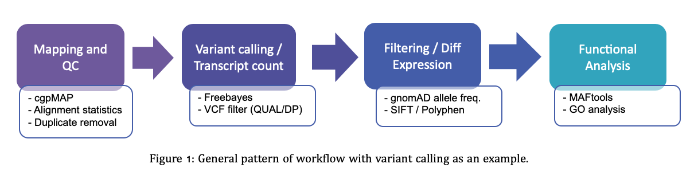
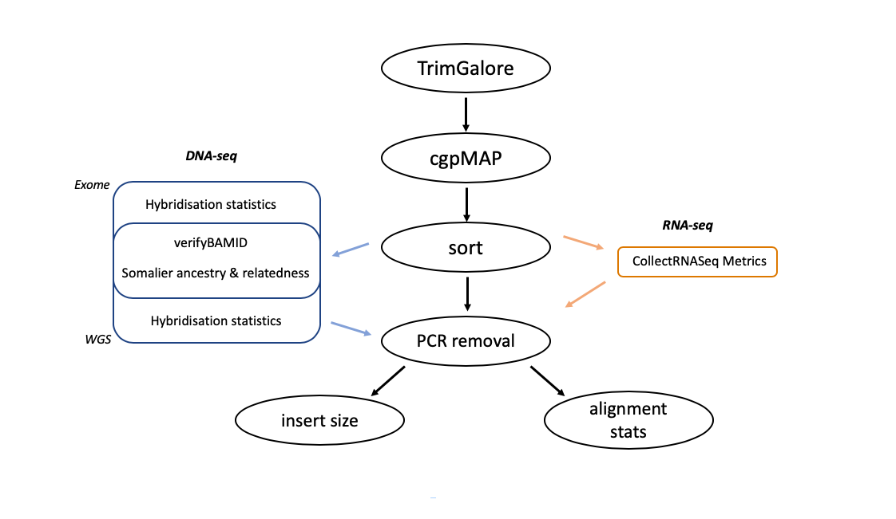

# UEA BCRE pipelines

 

<!-- TABLE OF CONTENTS -->
## Table of Contents

 

* [Introduction](#Introduction)
  - [Quality Control](#Quality-Control)
  - [Pipelines](#Pipelines-available)

* [Usage](#Usage)
  - [Software Requirements](#Software-Requirements)
  - [Example](#Example)

 

## Introduction

 

At UEA MEDgenomics we have developed a number of pipelines specialising for processing sequencing data. Mainly the processing of DNA-seq for identification of variants. We have developed a system that allows the easy use of these pipelines by downloading the github repository, editing a config file and copying the nextflow scripts to the working directory.

 

Irrespective of the pipelines chosen, all workflows perform similar analyses:

 

 

### Quality Control

 

All pipelines start with a QC modules, which contains a backbone that is present across all pipelines (black, figure2). Dependent on the type of data used extra tools are added onto this backbone. Therefore, if you are planning to process exome dna-seq data for somatic mutations then you would select follow the Exome-germline pipeline tutorial in this repo.

 

### Pipelines available

Below are the pipelines we have developed. Please click on the links for instructions on how to use and set up.

DNA-seq:

  - Exome-germline (Freebayes and GATK HaplotypeCaller)
  - Exome-somatic (Sanger-cgpWXS and GATK Mutect2)

  - Whole-genome germline (Freebayes and GATK HaplotypeCaller)
  - Whole-genome somatic (Sanger-cgpWGS and GATK Mutect2)
  - Whole-genome structural variants (Sanger-XXX)

RNA-seq:

  - mRNA RNA-seq (nfcore/RNAseq)

## Usage

### Software Requirements

As a mininum you will require the following dependencies:

  - Singularity (v3+)
  - Nextflow (v19+)
  - git and git account
  - A HPC account (developed for slurm)

### Input names

Currently, the pipeline only receives fastq.gz input files and these require their names to be formatted to allow the pipeline to run . Below shows the correct format with an example:

The entries can be named anything, it is the dashes that are important to seperate these fields in the pipeline. Also, if there is one sample from different lanes, ensure that the sample field are the same in both.
